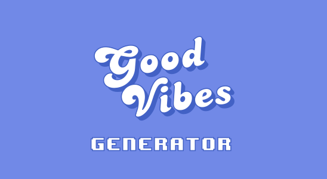

# Good Vibes generator

//TODO insert image from Teams conversation

## idea

We all deserve some good vibes these days! get your good vibes generator today!It will proactively send good vibes as an Adaptive card to a Teams conversation. You need more good vibes? Just ask the bot anything, it will reply with more good vibes!

## tech

To make the Good Vibes generator work, we use Cosmos DB and Azure Functions. Head over to our [deployment guide](docs/deploymentGuide.md) for more details!

## developers

This solution is an idea by [Lee Ford](https://twitter.com/Lee_Ford) and [Luise Freese](https://twitter.com/LuiseFreese).

## contributions

If you spot a bug, want to extend the scenario or have any additional feedback, please raise an issue or contact us via twitter.
