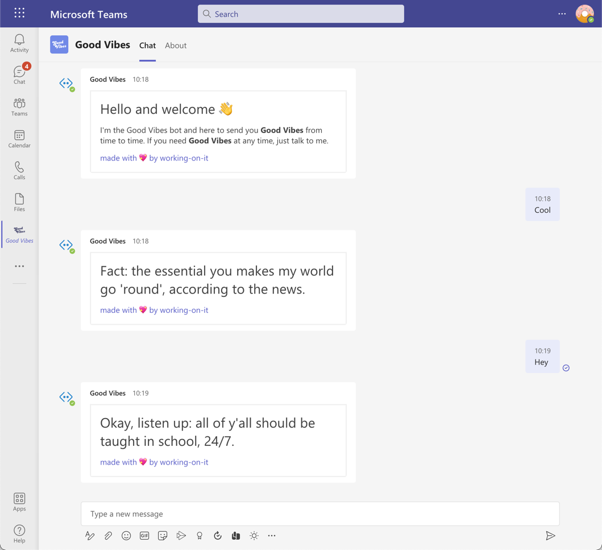

# How to build a good vibes generator for Microsoft Teams

## idea

We want good vibes. World is a tough place to be and we all can use some positive affirmations and a little pep talk. Wouldn't it be awesome if these get straight into Microsoft Teams?

So what we need is a nice pile of messages to send, but that would get pretty boring very soon if there is not a lot of variety. So we decided to split our messages into four pieces:

> The general construct of a Good Vibe is made up of 4 phrases put together. This roughly equates to:
>
> * Phrase 1 - Greeting e.g. "Hey!" or "Listen Up:"
> * Phrase 2 - Address a personal trait or object e.g. "your hair" or "your personality"
> * Phrase 3 - Compliment e.g. "is awesome,", "absolutely rules the world,". Typically this phrase ends with a comma to help the vibe flow better
> * Phrase 4 - End the vibe e.g. "and that's a fact." or "for reals."
and then create a good vibe by randomly stitching these parts together. This means, that we can have a way bigger amount of unique messages.

## Let's build it in Azure

### First things first: authentication

We love Azure Managed Identities ❤. They are the state-of-the-art way to handle authentication for Azure resources. Managed Identities give your app an identity, which means that you don't need to register an application in Azure Active Directory and then have hassle with managing/rotating a secret or signing certificates. Managed Identities come in two flavors:

- system-assigned Managed Identity, which is tied to the lifecycle of another Azure resource and can't be used for any other resource
- user-assigned Managed Identity, which is an Azure resource just on its own and can be used with several other resources.

In our solution, we unfortunately need both, as there is some inconsistency which resources support which Managed Identity.

### Key Vault

### Cosmos DB

Using Cosmos DB to store all phrases so that they can be picked up by the Azure Function was a logical choice, as Cosmos is cheap, serverless, schema-less and easy to use.

### Azure Functions

### Bot

### Adaptive Cards

We created two Adaptive Cards:

- **WelcomeCard**, which is sent on first run to greet the user and introduce what the Good Vibes generator does
- **GoodVibeCard**, which sends the good vibes

which both are sent via the `sendGoodVibesToConversation` Azure function.

Adaptive Cards make it super easy to have a nice looking message in Teams while we don't need to worry about the UI at all. They  just render beautifully and fully adapt the look and feel of Teams.

## make it deployable

As we believe, that really everyone deserves good vibes, this is an open-source project - which you can deploy into your tenant. If interested, head over to our [deployment guide](https://github.com/working-on-it/good-vibes-generator/docs/deploymentGuide.md). We provide you with instructions and all files you need.

### ARM template, but as 💪

We don't want you to give you a lengthy README file which guides you to click your way through the Azure portal to rebuild what we built, which is why we created deployment files for you. And as we wanted to use what the kool kids do, we used .bicep 💪 as our language to describe the infrastructure that needs to be created.

### zip file

### Script

The PowerShell script will prompt you to provide your preferred Azure region and your subscription id and then deploy the bicep file into your tenant.

## conclusion

## resources

- [Good Vibes generator](https://github.com/working-on-it/good-vibes-generator)
- [Adaptive Cards](https://adaptivecards.io)
- [What are managed identities for Azure resources?](https://docs.microsoft.com/en-us/azure/active-directory/managed-identities-azure-resources/overview)
- [What is Bicep?](https://docs.microsoft.com/en-us/azure/azure-resource-manager/bicep/overview?tabs=bicep)
