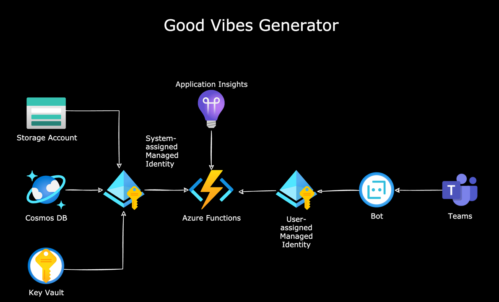

# Deployment guide

This guide shall walk you though the steps that you need to do in order to deploy the our Good Vibes Generator into your tenant.

## Overview

It's a good idea to first familiarize yourself with the resources:

* We chose cosmos DB to store the data, because its fast, cheap, server-less, schema-less and works well with storing JSON documents (e.g. bot conversations)
* At the very heart of the solution, you will find the Good Vibes function app, which is the brain of the Good Vibes generator. It contains 7 different functions which orchestrate the conversation with the bot and send messages to the user as Adaptive Cards
* We use [Azure Managed Identities](https://docs.microsoft.com/azure/active-directory/managed-identities-azure-resources/overview) to handle authentication which means that no app registration in Azure Active Directory is necessary
* Users interact with the bot in a chat in Microsoft Teams

## Deploying

1. Open [Azure cloud shell](https://shell.azure.com). If prompted, choose "PowerShell" shell type.
2. Run `wget https://github.com/working-on-it/good-vibes-generator/releases/latest/download/good-vibes-generator.zip && unzip good-vibes-generator -d good-vibes-generator && cd good-vibes-generator/deployment`
3. Run `./deploy.ps1`
4. The script will prompt you to provide
   * `Location` - this is the Azure region that you want to use. If you need to get an overview about the available regions, type `az account list-locations -o table`
   * `SubscriptionId` - Your Azure subscription ID (you can either obtain this from the [Azure portal](https://portal.azure.com/#blade/Microsoft_Azure_Billing/SubscriptionsBlade) or with `az account show --output table`)
   * `AzureResourcePrefix` - The prefix that will be used in-front of your azure resources e.g. "gvg123"
   * (Optional) `ResourceGroupName` - The name of the resource group that will be used/created within the subscription. If not specified, **GoodVibesGenerator** will be used

The script will now deploy all resources in your tenant. You can check in the Azure portal after you see the **Deployment completed** message.

To add Good Vibes to Teams,

* Go to your **Good Vibes** resource group (default is **GoodVibesGenerator**)
* Select the **_*_-bot** resource
* Select **Channels**
* Select the **Open in Teams** link.

## Change good vibes

If you want to change some phrases, remove some or add new one, this can be done in the `config` container in Cosmos in Item **0**.  You will find 4 arrays that hold all phrases that make the good vibes. Feel free to share your additions with us 💖.

